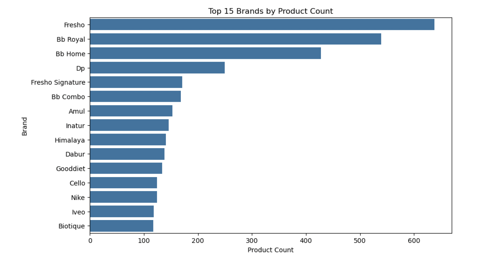
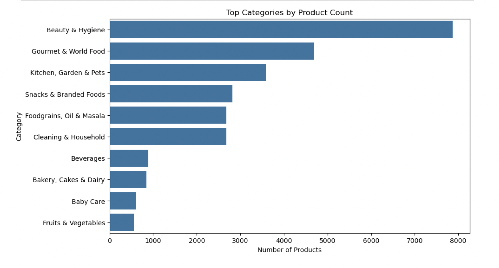
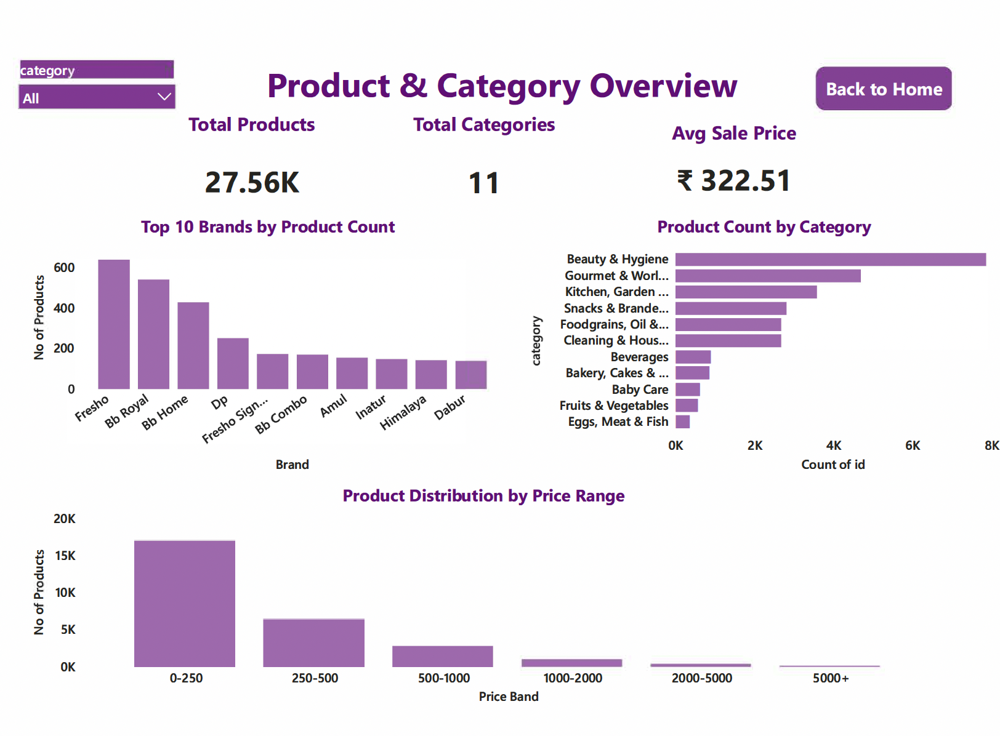

# BigBasket E-Commerce Analytics – Product Assortment & Brand Insights

## 📌 Overview
This project analyzes BigBasket’s e-commerce product catalog to understand **category-wise assortment depth, brand-level concentration, and pricing distribution**, with the goal of supporting **assortment planning, brand strategy analysis, and catalog optimization**.

---

## 📂 Dataset
- **Source**: BigBasket product catalog dataset  
- **Records**: ~27,500 products  
- **Key Attributes**: Category, sub-category, brand, sale price, market price, discount, ratings  

---

## 🔍 Analysis Focus
The analysis focuses on:
- Category-level product distribution  
- Brand-wise product concentration  
- Pricing and discount patterns across the catalog  

---

## 📊 Exploratory Data Analysis (Key Findings)

### 1️⃣ Brand-wise Product Assortment

**Insight:**  
A small number of brands contribute a large share of products across multiple categories, indicating **high brand concentration** within the catalog and potential dependence on a limited set of brands.

---

### 2️⃣ Category-wise Product Assortment

**Insight:**  
Categories such as **Beauty & Hygiene** and **Gourmet & World Food** show deeper assortments, while categories like **Baby Care** and **Fruits & Vegetables** have relatively fewer product listings.

---

## 📈 Power BI Dashboard
A Power BI dashboard was built to provide a consolidated view of:
- Category-wise product distribution  
- Brand-level product concentration  
- Price band segmentation and discount patterns  

---

## 🛠 Tools & Technologies
- **Python** (Pandas, NumPy, Matplotlib, Seaborn)  
- **Jupyter Notebook** for exploratory data analysis  
- **Power BI** for interactive dashboarding  

---

## 💼 Business Impact
- Identified **brand concentration patterns** across categories  
- Highlighted categories with **high and low assortment depth**  
- Supported data-driven decisions for **catalog optimization and pricing review**
